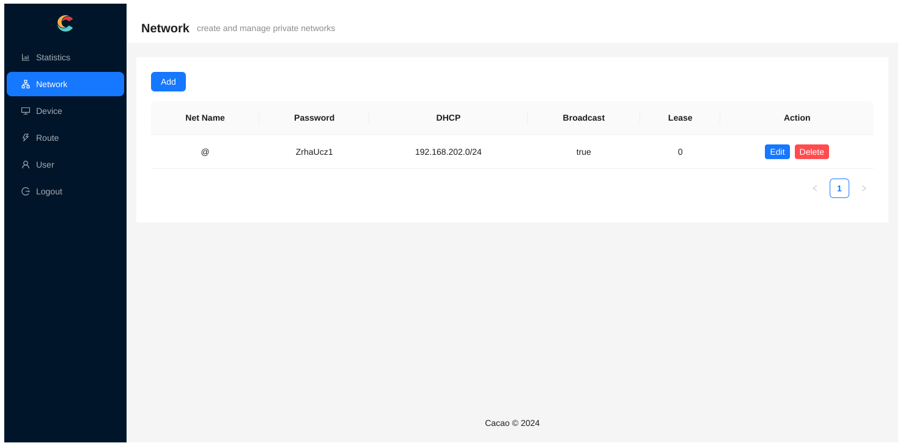

# 使用社区服务器

社区服务器支持用户级别的隔离,同时支持一个用户创建多个网络.

__社区服务器将定期清理不活跃用户,请确保短期内至少有一台设备连接过服务器,或手动登录过服务器管理页面.__

## 注册

在社区服务器[注册](https://canets.org/register),示例中的用户名为 `username`.


## 使用默认网络

查看网络,可以注意到已经有一个名称为 @ 的默认网络,密码是 `ZrhaUcz1`



连接到这个网络的客户端仅需要修改以下配置,关于配置文件的位置请参考客户端安装的相关文档:

```cfg
websocket = "wss://canets.org/username"
password = "ZrhaUcz1"
```

## 多个网络

点击左上角 `Add` 可以创建多个网络,例如:


这个新网络,网络名为 `netname`, 这会体现到 `websocket` 参数中; 密码为空; 网络范围是 `10.0.0.0/24`; 不允许广播; 且租期为 3 天, 即超过 3 天不活跃的客户端将被自动从网络中移除, 配置为 0 时表示不自动移除.

客户端的配置应该为:

```cfg
websocket = "wss://canets.org/username/netname"
password = ""
```

如果要给某个客户端指定静态地址 `10.0.0.1/24`, 只需要修改配置中的:

```cfg
tun = "10.0.0.1/24"
```
